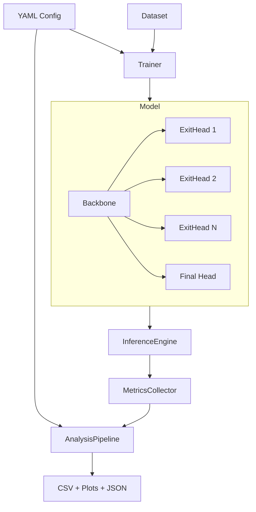

# Design Document: Confidence-Based Early Exit

## Overview

This system augments deep neural networks with intermediate exit points that allow inference to terminate early when a prediction confidence threshold is met. The core research question is: how effectively can confidence-based early stopping reduce computation while preserving accuracy?

The design supports two backbone tracks:
- **Option A**: CNN on CIFAR-10 — fast baseline with convolutional exit heads
- **Option B**: Transformer/MLP on CIFAR-10/100 — stronger variant with progressive inference

Both tracks share the same `ExitHead`, `InferenceEngine`, `MetricsCollector`, and `AnalysisPipeline` components. The system is fully configured via a single YAML file and produces reproducible results via seeded RNGs.

### Key Design Decisions

- **Max-softmax confidence** is the default metric (simple, well-studied); normalized entropy is an opt-in alternative.
- **Joint training** of all exit heads with configurable per-head loss weights avoids the complexity of staged training.
- **Threshold sweep at inference time** — the model is trained once and evaluated across many thresholds without reloading weights.
- **FLOPs are computed analytically** (not profiled) for reproducibility across hardware.

---

## Architecture



### Component Responsibilities

| Component | Responsibility |
|---|---|
| `EarlyExitModel` | Backbone + attached ExitHeads; forward pass returns per-exit logits |
| `ExitHead` | Lightweight classifier; computes confidence score from logits |
| `InferenceEngine` | Applies threshold decisions in exit-layer order; returns first confident prediction |
| `MetricsCollector` | Records per-sample metrics; aggregates over dataset |
| `AnalysisPipeline` | Runs threshold sweep; produces trade-off table, plots, CSV |
| `ConfigLoader` | Parses and validates YAML; raises descriptive errors on missing fields |
| `PrettyPrinter` | Serializes resolved config back to valid YAML |

---

## Components and Interfaces

### EarlyExitModel

```python
class EarlyExitModel(nn.Module):
    def __init__(self, backbone: nn.Module, exit_layer_indices: list[int],
                 num_classes: int, confidence_method: str = "max_softmax"):
        ...

    def forward(self, x: Tensor) -> list[ExitOutput]:
        """Returns one ExitOutput per exit head plus the final head."""
        ...
```

- Validates that all `exit_layer_indices` are within backbone depth at `__init__` time.
- `forward` always runs all layers (used during training); `InferenceEngine` handles early stopping.

### ExitHead

```python
@dataclass
class ExitOutput:
    exit_layer: int          # 1-based index
    logits: Tensor           # shape: (batch, num_classes)
    confidence: Tensor       # shape: (batch,)  in [0, 1]
    predicted_class: Tensor  # shape: (batch,)

class ExitHead(nn.Module):
    def forward(self, features: Tensor) -> ExitOutput: ...
```

- Raises `RuntimeError` if logits contain NaN/Inf, identifying the exit layer.
- Confidence computed as `max(softmax(logits))` or `1 - H(p)/log(C)` per config.

### InferenceEngine

```python
class InferenceEngine:
    def __init__(self, model: EarlyExitModel): ...

    def infer(self, x: Tensor, threshold: float) -> InferenceResult: ...
```

```python
@dataclass
class InferenceResult:
    predicted_class: int
    confidence: float
    exit_layer: int          # index of exit used; final layer index if no early exit
    flops_consumed: int
    inference_time_ms: float
```

- Processes exit heads in ascending layer order.
- Returns at first exit where `confidence >= threshold`.
- Falls back to final head if no exit fires.

### MetricsCollector

```python
class MetricsCollector:
    def record(self, result: InferenceResult, ground_truth: int) -> None: ...
    def aggregate(self) -> AggregatedMetrics: ...
    def save_json(self, path: str) -> None: ...
```

```python
@dataclass
class AggregatedMetrics:
    accuracy: float
    mean_flops: float
    mean_inference_time_ms: float
    exit_frequency: dict[int, float]   # exit_layer -> fraction of samples
```

### AnalysisPipeline

```python
class AnalysisPipeline:
    def run_sweep(self, thresholds: list[float]) -> TradeoffTable: ...
    def save_csv(self, table: TradeoffTable, path: str) -> None: ...
    def plot_accuracy_vs_flops(self, table: TradeoffTable, path: str) -> None: ...
    def plot_accuracy_vs_time(self, table: TradeoffTable, path: str) -> None: ...
```

### ConfigLoader / PrettyPrinter

```python
class ConfigLoader:
    def load(self, path: str) -> ExperimentConfig: ...   # raises on missing fields

class PrettyPrinter:
    def format(self, config: ExperimentConfig) -> str:   # valid YAML string
        ...
```

---

## Data Models

### ExperimentConfig

```python
@dataclass
class ExperimentConfig:
    # Model
    backbone: str                        # "cnn" | "transformer" | "mlp"
    exit_layer_indices: list[int]        # 1-based, must be < total layers
    confidence_method: str               # "max_softmax" | "entropy"
    exit_loss_weights: list[float]       # one per exit head + final; defaults to equal

    # Training
    optimizer: str                       # "sgd" | "adam"
    learning_rate: float
    lr_scheduler: str | None             # "cosine" | "step" | None
    num_epochs: int
    batch_size: int

    # Evaluation
    threshold_sweep: list[float]         # e.g. [0.5, 0.6, ..., 0.99]

    # Data
    dataset: str                         # "cifar10" | "cifar100"
    dataset_path: str
    augmentation: AugmentationConfig

    # Reproducibility
    random_seed: int

    # Output
    output_dir: str

@dataclass
class AugmentationConfig:
    random_crop: bool = True
    horizontal_flip: bool = True
    crop_padding: int = 4
```

### FLOPs Accounting

FLOPs per layer are computed analytically at model construction time and stored as a list. The FLOPs consumed for a sample exiting at layer `k` is the prefix sum up to and including layer `k` plus the ExitHead's FLOPs.

```python
@dataclass
class LayerFLOPs:
    layer_index: int
    backbone_flops: int
    exit_head_flops: int
```

---


## Correctness Properties

*A property is a characteristic or behavior that should hold true across all valid executions of a system — essentially, a formal statement about what the system should do. Properties serve as the bridge between human-readable specifications and machine-verifiable correctness guarantees.*

### Property 1: Exit heads are placed at configured indices

*For any* backbone type (CNN, Transformer, MLP) and any valid list of exit layer indices, the constructed `EarlyExitModel` shall have exit heads attached at exactly those layer indices and no others.

**Validates: Requirements 1.1, 1.2, 1.3, 1.4**

---

### Property 2: Invalid exit layer index raises at construction

*For any* backbone and any exit layer index that exceeds the backbone's total layer count, constructing an `EarlyExitModel` with that index shall raise a configuration error before any computation.

**Validates: Requirements 1.5**

---

### Property 3: Max-softmax confidence correctness

*For any* logit tensor with finite values, the `ExitHead` output's confidence score shall equal `max(softmax(logits))` and the predicted class shall equal `argmax(logits)`.

**Validates: Requirements 2.1, 2.2**

---

### Property 4: Entropy-based confidence correctness

*For any* logit tensor with finite values and any `num_classes > 1`, when entropy mode is configured, the confidence score shall equal `1 - H(softmax(logits)) / log(num_classes)` and remain in [0, 1].

**Validates: Requirements 2.3**

---

### Property 5: Non-finite logits raise a runtime error

*For any* logit tensor containing at least one NaN or Inf value, calling `ExitHead.forward()` shall raise a `RuntimeError` that identifies the exit layer index.

**Validates: Requirements 2.4**

---

### Property 6: Early exit fires at first confident head

*For any* model and input where at least one exit head produces `confidence >= threshold`, the `InferenceEngine` shall return the prediction from the exit head with the smallest layer index that meets the threshold.

**Validates: Requirements 3.1, 3.4**

---

### Property 7: Fallback to final layer when no exit fires

*For any* model and input where no exit head produces `confidence >= threshold`, the `InferenceEngine` shall return the final backbone layer's prediction and record the final layer index.

**Validates: Requirements 3.2**

---

### Property 8: Weighted loss equals sum of per-exit losses

*For any* training batch and any list of loss weights, the total training loss shall equal the weighted sum of cross-entropy losses from all exit heads and the final head, with default weights being equal across all exits.

**Validates: Requirements 4.1, 4.2**

---

### Property 9: All exit head parameters receive gradients

*For any* training batch, after a backward pass, every parameter in every `ExitHead` shall have a non-None gradient tensor.

**Validates: Requirements 4.3**

---

### Property 10: MetricsCollector records all required fields per sample

*For any* inference result and ground-truth label passed to `MetricsCollector.record()`, the stored record shall contain the predicted label, ground-truth label, exit layer index, and inference time in milliseconds.

**Validates: Requirements 5.1**

---

### Property 11: FLOPs per sample equals prefix sum up to exit layer

*For any* model and any exit layer index `k`, the FLOPs reported for a sample exiting at layer `k` shall equal the sum of backbone FLOPs for layers 1 through `k` plus the exit head FLOPs at layer `k`.

**Validates: Requirements 5.2**

---

### Property 12: Exit frequency sums to 1

*For any* collection of inference results, the exit frequencies across all exit layers shall sum to 1.0, and each frequency shall equal the fraction of samples that exited at that layer.

**Validates: Requirements 5.3, 5.4**

---

### Property 13: Metrics JSON round-trip

*For any* `AggregatedMetrics` object, serializing it to JSON via `save_json()` and then deserializing the file shall produce an equivalent `AggregatedMetrics` object.

**Validates: Requirements 5.5**

---

### Property 14: Trade-off table completeness

*For any* list of threshold values, the trade-off table produced by `AnalysisPipeline.run_sweep()` shall contain exactly one row per threshold, and each row shall include accuracy, mean FLOPs, mean inference time, and per-layer exit frequency.

**Validates: Requirements 6.1, 6.2**

---

### Property 15: Trade-off CSV round-trip

*For any* `TradeoffTable`, serializing it to CSV via `save_csv()` and then loading the file shall produce a table with equivalent rows and values.

**Validates: Requirements 6.5**

---

### Property 16: Threshold 1.0 forces all samples to final layer

*For any* model and dataset, running inference with `threshold = 1.0` shall result in every sample reaching the final backbone layer (no early exits), matching the full-depth baseline.

**Validates: Requirements 7.1**

---

### Property 17: Comparison metrics are computed correctly

*For any* baseline metrics and early-exit metrics, the reported FLOPs reduction shall equal `(baseline_flops - early_exit_flops) / baseline_flops` and the accuracy drop shall equal `baseline_accuracy - early_exit_accuracy`.

**Validates: Requirements 7.2, 7.3**

---

### Property 18: Seeded runs are reproducible

*For any* random seed and experiment configuration, running the experiment twice with the same seed shall produce identical model weights, predictions, and metrics.

**Validates: Requirements 8.3**

---

### Property 19: Missing required config field raises before computation

*For any* required configuration field, omitting it from the YAML input shall cause `ConfigLoader.load()` to raise a descriptive error before any model initialization or data loading occurs.

**Validates: Requirements 8.4**

---

### Property 20: Configuration round-trip

*For any* valid `ExperimentConfig` object, parsing the YAML produced by `PrettyPrinter.format()` shall yield an equivalent `ExperimentConfig` object.

**Validates: Requirements 8.5, 8.6**

---

### Property 21: Training transforms include augmentation; eval transforms do not

*For any* dataset configuration with augmentation enabled, the training data loader shall apply random crop and horizontal flip, while the evaluation data loader shall apply only center-crop normalization.

**Validates: Requirements 9.3**

---

### Property 22: Invalid dataset path raises before model initialization

*For any* dataset path that does not exist or cannot be accessed, `DatasetLoader.load()` shall raise a descriptive error before the model is constructed.

**Validates: Requirements 9.4**

---

## Error Handling

| Condition | Component | Behavior |
|---|---|---|
| Exit layer index out of range | `EarlyExitModel.__init__` | Raise `ConfigurationError` with layer index and backbone depth |
| Logits contain NaN or Inf | `ExitHead.forward` | Raise `RuntimeError` identifying exit layer index |
| Missing required config field | `ConfigLoader.load` | Raise `ConfigurationError` identifying the missing field name |
| Dataset path not found | `DatasetLoader.load` | Raise `DatasetError` before model init |
| Output directory not writable | `MetricsCollector.save_json`, `AnalysisPipeline.save_csv` | Raise `IOError` with path |
| Invalid confidence method | `EarlyExitModel.__init__` | Raise `ConfigurationError` listing valid options |

All errors include human-readable messages. No silent fallbacks.

---

## Testing Strategy

### Dual Testing Approach

Both unit tests and property-based tests are required. They are complementary:
- **Unit tests** cover specific examples, integration points, and error conditions.
- **Property tests** verify universal correctness across randomly generated inputs.

### Property-Based Testing

**Library**: [`hypothesis`](https://hypothesis.readthedocs.io/) (Python)

Each correctness property above maps to exactly one property-based test. Tests are tagged with a comment in the format:

```
# Feature: confidence-based-early-exit, Property N: <property_text>
```

Minimum 100 iterations per property test (Hypothesis default `max_examples=100`).

Example:

```python
from hypothesis import given, settings
import hypothesis.strategies as st

# Feature: confidence-based-early-exit, Property 3: Max-softmax confidence correctness
@given(logits=st.lists(st.floats(min_value=-10, max_value=10), min_size=2, max_size=100))
@settings(max_examples=100)
def test_max_softmax_confidence(logits):
    tensor = torch.tensor(logits)
    output = exit_head(tensor.unsqueeze(0))
    expected_conf = torch.softmax(tensor, dim=0).max().item()
    assert abs(output.confidence.item() - expected_conf) < 1e-5
    assert output.predicted_class.item() == tensor.argmax().item()
```

### Unit Tests (Examples and Integration)

- Optimizer compatibility: verify SGD and Adam train without error (Req 4.4)
- CIFAR-10 dataset loads with correct split sizes (Req 9.1)
- CIFAR-100 loads for Transformer/MLP backbone (Req 9.2)
- Config log file is written to output directory after experiment run (Req 8.2)
- Plots are generated at configured paths (Req 6.3, 6.4)
- Full pipeline integration test: train for 1 epoch, run sweep, verify output files exist

### Test Organization

```
tests/
  unit/
    test_exit_head.py
    test_inference_engine.py
    test_metrics_collector.py
    test_analysis_pipeline.py
    test_config_loader.py
    test_dataset_loader.py
  property/
    test_exit_head_props.py
    test_inference_engine_props.py
    test_metrics_props.py
    test_analysis_props.py
    test_config_props.py
  integration/
    test_full_pipeline.py
```
